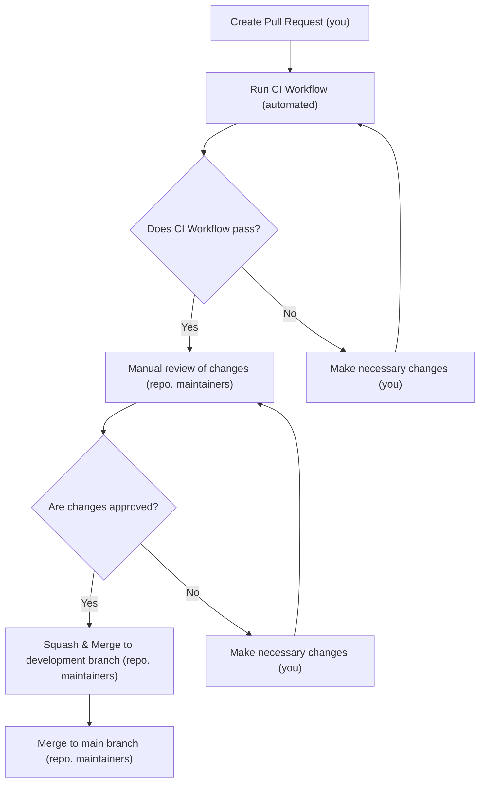

# Contributing to Serpentarius

Thank you for your interest in contributing to this project. Below you'll find guidelines and recommendations to make the contribution process easier.

## How to Contribute 🤔

1. **Fork the Repository**: Create a fork of the original repository in your GitHub account.

2. **Keep Your Fork Updated**: Make sure to keep your fork in sync with the original repository. You can do this by configuring the original repository as an additional remote and pulling changes regularly.

```bash
# Add the original remote
git remote add upstream https://github.com/PChaparro/serpentarius
# Fetch changes from the original remote
git fetch upstream
# Update the main branch
git checkout main
git merge upstream/main
```

3. **Create a New Branch**: While you can make changes directly to the `main` branch of your fork, it's better to create a new branch for each feature or bug fix. This makes it easier to manage changes and reviews.

You can use any name for your branch, but we recommend following the same naming standard we use for commits ([Conventional Commits](https://www.conventionalcommits.org/en/v1.0.0/)).

```bash
# Create a new branch
git checkout -b feat/new-feature
```

Additionally, if the new feature or bug fix is related to a specific issue, you can include the issue number in the branch name. For example, `feat/#123-new-feature` or `fix/#123-bug-fix`. This helps maintain a clear record of which changes relate to which issues.

4. **Make Changes**: Make the necessary changes in your branch. Be sure to follow the project's style guidelines and conventions.

For example, we prefer many small commits rather than a single large commit with all changes. This makes it easier to review and track the changes made.

For commit messages, we follow the [Conventional Commits](https://www.conventionalcommits.org/en/v1.0.0/) standard. This means each commit message should start with a type (like `feat`, `fix`, `docs`, etc.) followed by a brief description of the change.

5. **Test Your Changes**: Make sure to test your changes before submitting a pull request. This includes running existing integration tests and adding new tests if your change requires it.

6. **Submit a Pull Request**: Once you have made and tested your changes, submit a pull request from your branch to the `development` branch of the original repository.

For the pull request title, use the same naming standard we follow when making commits or creating branches. For example, `feat: new feature` or `fix: bug fix`. This helps maintain a clear record of what changes are being proposed.

For the pull request description, follow the format in the [PULL_REQUEST_TEMPLATE.md](.github/pull_request_template.md) file in the repository (this should appear by default when creating a new pull request; you just need to change the content of the different sections as appropriate).

## Approved Changes Workflow 🔄

The following diagram describes the process we follow to introduce changes into the repository:



When introducing changes to the development branch, we **always** use squash & merge. This means all commits from the pull request branch are combined into a single commit before being merged into the development branch. This helps maintain a clean and easy-to-follow commit history.

In contrast, when introducing changes to the `main` branch, we use a normal merge. This means all commits from the pull request branch remain separate and are merged into the `main` branch as they are. This is useful for maintaining a clear record of what changes have been introduced in the production version of the project.

Please note that your changes may **not** be sent to the `main` branch immediately. Instead, we might wait for several changes to accumulate in the development branch before merging to the `main` branch. While this is **not** the most common case, it's important to keep in mind to avoid confusion. Normally, changes will be sent to the `main` branch after being approved and merged into the `development` branch to ensure the library is always up to date.

## Project Architecture 🏗️

Serpentarius uses Hexagonal Architecture (also known as Ports and Adapters) to ensure modularity, maintainability, and testability. This architectural approach allows us to separate business logic from external dependencies, making the system more adaptable to changes.

### Hexagonal Architecture Overview

The project is organized into three main layers:

1. **Domain Layer** (equivalent to Ports):

   - Contains business entities, interfaces (ports), and core business logic
   - Located in `domain` directories
   - **Import Rule**: Domain can only import from other domain packages

2. **Application Layer**:

   - Contains use cases that orchestrate the business logic
   - Located in `application` directories
   - **Import Rule**: Application can only import from domain packages and from other application packages.

3. **Infrastructure Layer** (equivalent to Adapters):
   - Contains implementations of interfaces defined in the domain layer
   - Located in `infrastructure` directories
   - **Import Rule**: Infrastructure can import from domain, application, and external libraries

### Example of Modularity

A good example of the benefits of this architecture is our caching implementation:

- Currently, we use Dragonfly (a Redis alternative) for caching, but the core application doesn't directly depend on it.
- Instead, the domain layer defines a `UrlCacheStorage` interface with `Set`, `Get`, and `Delete` methods.
- The infrastructure layer provides a Redis implementation of this interface.
- Thanks to dependency injection, we could easily swap the Redis implementation with any other caching solution (like Memcached or an in-memory cache) without changing any business logic.

This approach applies to all external dependencies in the project, making it more maintainable and flexible.

### Folder Structure

```
internal/modules/
├── pdf/                        # PDF Module
│   ├── domain/                 # Domain layer (business rules)
│   │   ├── definitions/        # Interfaces (ports)
│   │   └── dto/                # Data Transfer Objects
│   ├── application/            # Application layer (use cases)
│   │   └── use_cases/
│   └── infrastructure/         # Infrastructure layer (adapters)
│       ├── http/               # HTTP transport
│       └── implementations/    # Interface implementations
└── shared/                     # Shared module
    ├── domain/
    ├── application/
    └── infrastructure/
```

When contributing, please respect these architectural boundaries and dependency rules to maintain the project's modularity and testability.
